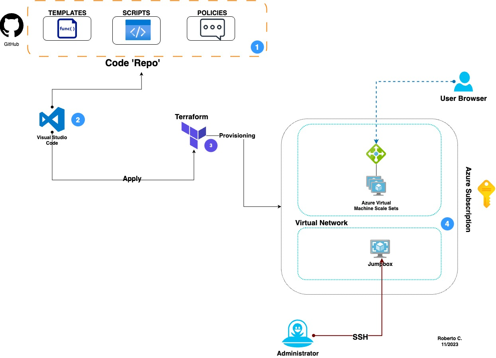

**Diagram of the resources to be provisioned:**

# Terraform 101

## Terraform commands:

_terraform output_ **Shows output values of the created resources**

_terraform show_ **Show Show output values contained in the output.tf**

**To view the generated password:**

_terraform output vm_password_

